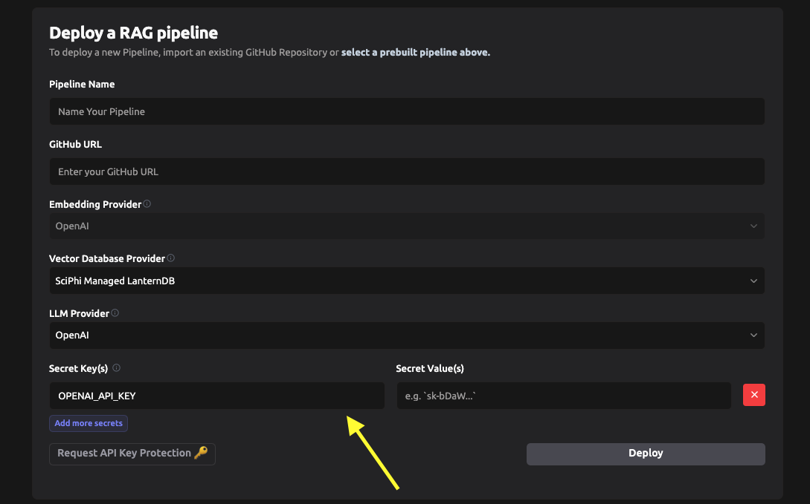

# SciPhi AI example

This is an example based on [SciPhi-AI/R2R-qna-rag-prebuilt](https://github.com/SciPhi-AI/R2R-qna-rag-prebuilt).

## How to execute it

Different modes:

* Local with pgvector
* Docker with pgvector (own infrastructure)
* SciPhi

### Required environment variables for all modes

* OPENAI_API_KEY
* ANTHROPIC_API_KEY: [anthropic.com](https://www.anthropic.com)
* CONFIDENTAI_API_KEY: For [Confident AI](https://confident-ai.com/)'s `deepeval` 
  prompt evaluations/monitoring. An alternative for this is [Parea AI](https://parea.ai).

```bash
$ export OPENAI_API_KEY=xxxxxx
$ export ANTHROPIC_API_KEY=yyyyyy
$ export CONFIDENT_API_KEY=zzzzzz
```

### Local with pgvector

Uses `src/app-external.py` application.

[pgvector](https://github.com/pgvector/pgvector/) is a vectorial database based
on PostgreSQL.

* CONFIG_PATH: JSON config file name.
* POSTGRES_USER
* POSTGRES_PASSWORD
* POSTGRES_HOST
* POSTGRES_PORT
* POSTGRES_DBNAME

Example: 

```bash
# Using Python >=3.12
$ python3 -m venv env
$ source env/bin/activate
(env) $ pip install -r requirements.txt
(env) $ export CONFIG_PATH="config-pgvector.json"
(env) $ export POSTGRES_USER=vectordb
(env) $ export POSTGRES_PASSWORD=vectordb
(env) $ export POSTGRES_HOST=localhost
(env) $ export POSTGRES_PORT=5432
(env) $ export POSTGRES_DBNAME=vectordb
(env) $ ./start.sh
```

### Docker with pgvector

Uses `src/app-external.py` application.

Modify the [docker-compose.yml](./docker-compose.yml) settings for the `sciphi`
container. This repository contains different service combinations:

* `config-litellm-pgvector.json`: Uses the pgvector `db` container and `litellm`
  as LLM provider (proxy to providers). Uses OpenAI's embeddings. See
  [Providers documentation](https://r2r-docs.sciphi.ai/providers/embeddings#available-models).
* `config-litellm-local_embeddings-pgvector.json`: Uses pgvector `db` container,
  `litellm` as proxy providers and `sentence_transformers` with
  [HuggingFace models](https://huggingface.co/) locally for embeddings.  
* `config-llama-cpp-pgvector.json`: Uses the pgvector `db` container and `llama-cpp`
  as LLM provider, using local [Ollama](https://ollama.com/library) models. Uses
  OpenAI's embeddings.

```bash
$ docker compose up  # -d to detach
```

### SciPhi

This environment uses the `config.json` and `src/app.py` files since those are
expected in their infrastructure.

Add required keys in deployments config:



* OPENAI_API_KEY
* ANTHROPIC_API_KEY
* CONFIDENT_API_KEY

## How to run queries

See [postman/QUERIES.md](postman/QUERIES.md).
